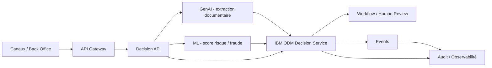

# Architecture initiale — MayaInsurance IARD Decision Platform

## Vue logique

## Responsabilités

- **GenAI** : transformer du contenu non structuré en données exploitables avec score de confiance.
- **ML** : produire des scores ou probabilités.
- **IBM ODM** : appliquer les règles métier IARD versionnées et explicables.
- **Workflow/Human Review** : gérer exceptions, faible confiance et décisions sensibles.
- **API/Event** : intégrer la capacité de décision au SI.
- **Observabilité/Audit** : conserver decision ID, versions de règles/modèles et résultat.

## Principe de souveraineté décisionnelle

Une sortie d’AI n’est jamais considérée comme une politique métier. Toute décision sensible doit être validée par des règles explicites et/ou une revue humaine selon le niveau de risque.

## Cible d’industrialisation

À partir des itérations ultérieures : OpenShift/Kubernetes, OAuth2/OIDC, mTLS, GitOps, CI-CD, observabilité, HA/PRA et tests de performance.
