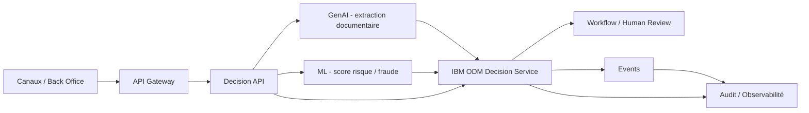
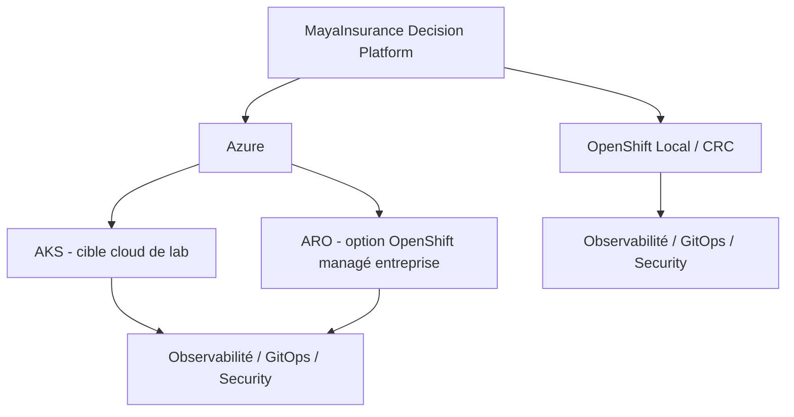

# Architecture initiale — MayaInsurance IARD Decision Platform

## Vue logique

## Responsabilités

- **GenAI** : transformer du contenu non structuré en données exploitables avec score de confiance.
- **ML** : produire des scores ou probabilités.
- **IBM ODM** : appliquer les règles métier IARD versionnées et explicables.
- **Workflow/Human Review** : gérer exceptions, faible confiance et décisions sensibles.
- **API/Event** : intégrer la capacité de décision au SI.
- **Observabilité/Audit** : conserver decision ID, versions de règles/modèles et résultat.

## Principe de souveraineté décisionnelle

Une sortie d’AI n’est jamais considérée comme une politique métier. Toute décision sensible doit être validée par des règles explicites et/ou une revue humaine selon le niveau de risque.

## Architecture de déploiement

### OpenShift Local / CRC

Cible prioritaire pour les développements et les labs : Decision API, IBM ODM, composants ML/GenAI, sécurité, observabilité et GitOps doivent d’abord être validés localement.

### Azure

- **AKS** : cible Kubernetes Azure de référence pour rejouer le lab dans le cloud.
- **ARO** : cible optionnelle lorsqu’un contexte entreprise exige OpenShift managé sur Azure.

La logique métier ODM, les modèles de décision et les contrats API ne changent pas selon la cible. Les différences sont limitées aux configurations de plateforme, overlays et IaC.

## Cible d’industrialisation

OpenShift Local / CRC pour la preuve locale, puis Azure AKS pour la validation cloud, avec ARO comme alternative d’architecture entreprise. OAuth2/OIDC, mTLS, GitOps, CI-CD, observabilité, HA/PRA et tests de performance seront ajoutés progressivement.
