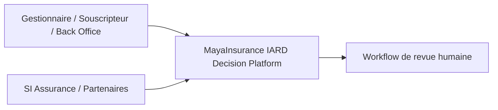
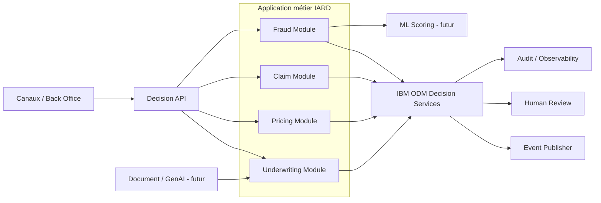

# Vue C4 logique — MayaInsurance IARD Decision Platform

## System Context

## Container View

## Mapping DDD -> composants

| Bounded Context | Composant logique | Décision principale |
|---|---|---|
| Underwriting | Underwriting Module | UnderwritingEligibility |
| Pricing | Pricing Module | PremiumDecision |
| Claim | Claim Module | ClaimCoverageDecision |
| Fraud | Fraud Module | FraudReviewDecision |

## Point d'architecture

Cette vue C4 est **logique** : elle ne préjuge pas du nombre final de déploiements ou de microservices. Les frontières DDD sont conservées même si plusieurs modules sont empaquetés ensemble dans le POC local.
