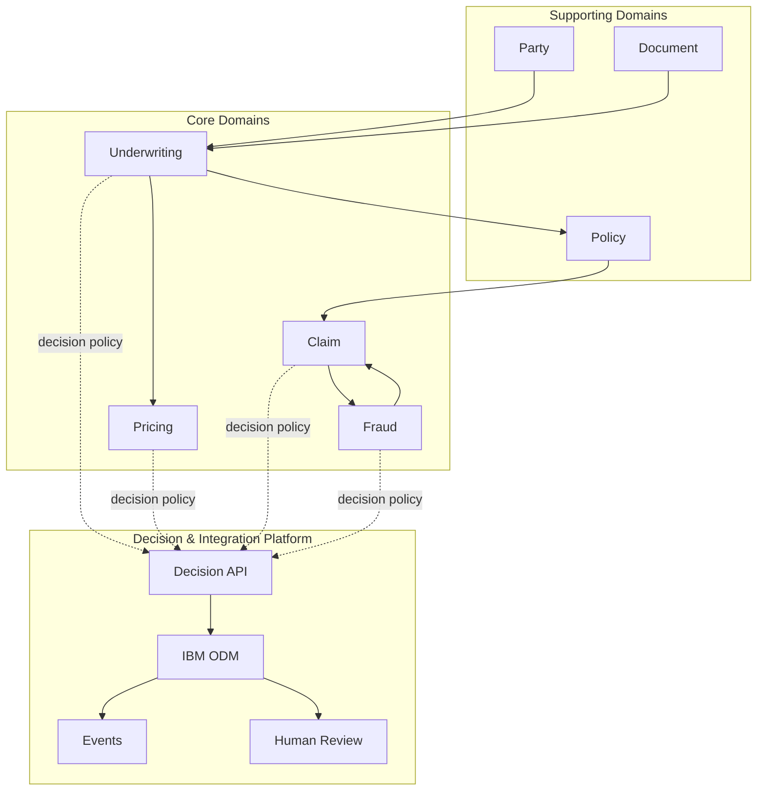

# Context Map — MayaInsurance IARD

## Relations principales

- **Party -> Underwriting** : fournit l'identité et les informations utiles à la demande.
- **Document -> Underwriting** : fournit des données structurées issues des pièces ; GenAI pourra enrichir ce flux ultérieurement.
- **Underwriting -> Pricing** : une demande éligible peut déclencher un calcul de prime.
- **Underwriting -> Policy** : une acceptation permet la préparation/création d'un contrat.
- **Policy -> Claim** : Claim consulte le contexte de couverture nécessaire à la décision de sinistre.
- **Claim <-> Fraud** : Claim demande une évaluation ; Fraud retourne un résultat/score, sans devenir propriétaire de la décision de couverture.

## Anti-pattern évité

Ne pas créer un bounded context `ODM` ou `Rules` : ce sont des capacités techniques. La responsabilité métier reste dans Underwriting, Pricing, Claim ou Fraud.
