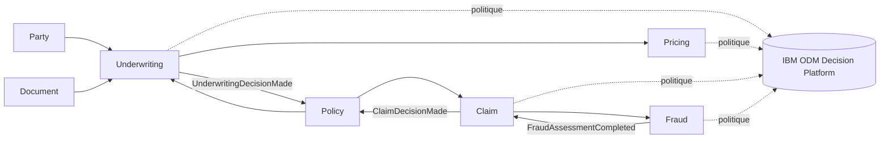

# Modèle de domaine IARD — v1

## Vue métier

## Agrégats et objets métier

### Underwriting

**Aggregate root : `Application`**

Objets principaux :
- `Applicant` ;
- `RiskProfile` ;
- `CoverageRequest` ;
- `UnderwritingDecision`.

Invariants de démonstration :
- une demande possède un identifiant stable ;
- une décision possède une version de politique ;
- un cas incomplet ne peut pas être accepté automatiquement ;
- un cas à risque élevé peut nécessiter une revue humaine.

### Pricing

**Aggregate root : `Quote`**

Objets principaux :
- `PricingInput` ;
- `BasePremium` ;
- `Adjustment` ;
- `PremiumDecision`.

### Claim

**Aggregate root : `ClaimCase`**

Objets principaux :
- `LossEvent` ;
- `ClaimedCoverage` ;
- `Deductible` ;
- `ClaimDecision`.

### Fraud

**Aggregate root : `FraudAssessment`**

Objets principaux :
- `FraudSignal` ;
- `RiskScore` ;
- `FraudReviewDecision`.

## Règle d'architecture

Un aggregate DDD n'implique pas automatiquement un microservice.

Le découpage physique sera décidé plus tard selon :
- autonomie de déploiement ;
- charge ;
- cycle de vie ;
- ownership équipe ;
- criticité ;
- besoin d'isolation.

Pour le POC, plusieurs bounded contexts pourront partager un même runtime applicatif tout en conservant leurs frontières métier.
